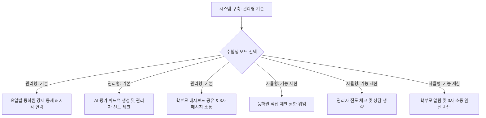
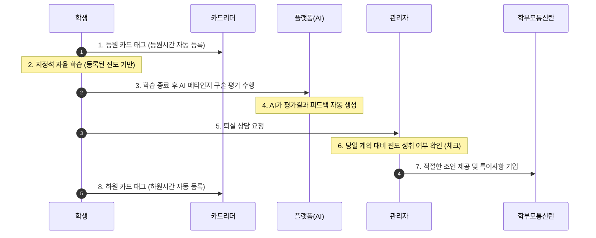

# 🏫 관리형 중심 스터디 카페 운영 툴 활용 가이드
> **MQstudy 자기주도학습 플랫폼 RAG 시스템 기반 운영 매뉴얼**

본 플랫폼은 강력한 관리가 강점인 **'관리형 스터디 카페(Managed Study Cafe)'** 비즈니스 모델을 기준으로 시스템이 설계되어 있습니다. 학생의 등록 상태를 **'자율형'**으로 선택(전환)할 경우, 관리 효율성을 위해 핵심 통제 기능 중 일부를 비활성화하고 학부모 알림 및 3자 소통 채널을 차단하는 형태로 작동합니다.

---

## 📌 1. 시스템 기본 설계 및 운영 흐름

시스템은 원장(관리자)이 세팅한 **'관리형 모델'**을 기반으로 작동하며, 자율형 선택 시 학생에게 자율 권한이 위임되고 학부모 공유 등의 핵심 통제 기능이 제한됩니다.

---

## 🔑 2. 계정 권한 및 역할 정의

### 1) 점주(원장) 및 관리자 (Admin)
*   **관리형 모드**: 첫 계약 시 학부모/학생과 대면 상담을 통해 진로 목표와 세부 진도 계획을 수립하고, 매일 일상 사이클에서 진도 이행 완료 여부를 체크하며 학부모 특이사항을 기록합니다.
*   **자율형 모드 (기능 제한)**: 학습 목표 및 가중치를 개입 없이 학생에게 일임하며, 매일 진행되는 대면 진도 체크 및 관리 일지 작성을 수행하지 않습니다.

### 2) 수험생 (Student)
*   **관리형 모드**: 카드리더를 통해 출결을 등록하고, 지정석에서 자습 후 AI 평가 및 원장 상담을 거쳐야만 정상적인 하원 처리가 완료됩니다.
*   **자율형 모드 (기능 제한)**: 본인의 대시보드 화면에서 직접 등하원을 처리하며, 관리자의 이행 체크 없이 자율적으로 학습하고 AI 평가만 참고용으로 수행합니다.

### 3) 학부모 (Parent)
*   **관리형 모드**: 실시간 등하원 기록 및 **'AI가 작성한 평가결과 피드백'**, 관리자가 체크한 **'진도 계획 달성 여부'**를 학부모 대시보드에서 조회하며, 3자 메시지 기능을 통해 원장/자녀와 소통합니다.
*   **자율형 모드 (기능 제한)**: **학부모에게 자녀의 학습 결과 알림 및 소통 기능이 전혀 제공되지 않으며**, 실시간 대시보드 접근 권한도 비활성화됩니다.

---

## 🛠️ 3. [관리형 모드] 프로세스 상세 매뉴얼

관리형 모드는 첫 등록 상담부터 일상 운영, 그리고 사후 관리까지 총 3가지 단계로 체계화되어 움직입니다.

### 1단계. 첫 계약 및 온보딩 상담 (학부모 + 학생 + 원장 3자 대면)
신규 학생 등록 시, 학부모와 학생이 함께 관리자와 대면 상담을 진행하며 다음 사항을 결정하고 합의합니다.

1.  **정기권(관리형) 이용 계약 확인**: 
    *   시간당 금액 확인 및 결제 조건 동의.
    *   구체적인 서비스 활용 방법 안내 (지정석 배정, 개인 사물함 사용 규칙 등).
    *   관리형 프로그램만의 특징 설명, AI를 통한 진도 확인 원리 안내.
    *   상담 가능 시간(예: 하원 전 18:00 ~ 22:00 사이 제한 등) 안내 및 합의.
2.  **요일별 등하원 시간 계획 수립**: 주간 공부 가능 요일 및 입퇴실 약속 시간을 요일별로 상세하게 입력합니다.
3.  **자녀 관리 및 개인정보 이용 동의**: 학부모 성명, 연락처를 등록하고 개인정보 이용 및 자녀 관리 규칙 동의서에 전자 사인을 완료합니다.
4.  **진로 목표 설정 및 학습 계획 협의**: 궁극적인 합격/성적 목표, 구체적인 학습 기간(언제부터 언제까지), 학습 목적과 주요 공부 과목을 상호 협의하여 등록합니다.
5.  **학습 과목 및 시간 배분**: 전체 가용 학습 시간 중 과목별로 가중치와 투자할 시간을 적절하게 배분합니다.
6.  **과목별 세부 단원 설정**: 과목별로 학습할 단원들을 상세하게 쪼개어 플랫폼 내 일일 진도표에 등록합니다.

---

### 2단계. 일상 학습 진행 사이클 (Daily Cycle)
매일 학생이 스터디 카페를 이용할 때 반복되는 기본 운영 프로세스입니다.

*   **지각 발생 시 프로토콜**: 
    *   약속된 등원 시간 기준 **10분 이상 지각**할 경우, 시스템 대시보드에 적색 비상 경고가 점등됩니다.
    *   관리자는 즉시 학부모에게 전화를 하거나 시스템에 미리 등록된 메시지 템플릿(카카오 알림톡/SMS)을 통해 지각 사실을 전달하고 사유를 확인합니다.

---

### 3단계. 소통 및 기간 연장 관리
*   **학부모 실시간 대시보드 조회**: 학부모는 모바일 대시보드를 통해 실시간 **출결 현황, 일일 진도율, AI가 평가하는 성취율**을 언제든지 확인할 수 있습니다.
*   **3자 소통 메신저**: 관리자, 학부모, 학생은 플랫폼 내 메시지 기능을 통해 실시간 출결 및 학습 성취도를 확인하며 소통 및 애로사항 조율을 위한 메시지를 자유롭게 주고받을 수 있습니다.
*   **정기권 만료 사전 안내**: 정기권 사용 종료일이 도래하기 전(예: 만료 7일 전, 3일 전), 시스템이 학생 본인의 대시보드 화면 및 학부모의 카카오 알림톡으로 만료 예정일과 재등록 링크가 포함된 안내 메시지를 자동으로 발송합니다.

---

## 📈 4. 독학(자율)형 vs 관리형 기능 제한 매트릭스

자율형 모드는 관리자가 직접 통제하지 않으므로, 관리형 모드의 주요 밀착 관리 기능이 다음과 같이 대폭 제한됩니다.

| 핵심 기능 영역 | 🏫 관리형 운영 (기본 모델) | 🎒 자율형 운영 (기능 제한 모드) |
| :--- | :--- | :--- |
| **최초 온보딩 상담** | 원장-학생-학부모 3자 계약 상담 및 계획 등록 | 학생 본인의 자율 목표 수립 (관리자 개입 없음) |
| **출결 승인 및 등록** | **실물 카드리더 태그 강제 (등하원 자동 기록)** | **학생 대시보드 상에서 수동 터치로 자율 등록** |
| **지각 대응** | 10분 지각 시 대시보드 경고 및 학부모 연락 | 비활성화 (지각 체크 안 함) |
| **진도 및 학습 점검** | AI 평가 피드백 자동 생성 + 관리자 대면 진도 체크 | 학생 자율 AI 구술 평가만 진행 (관리자 확인 없음) |
| **학부모 결과 알림** | **실시간 알림 발송** (AI 피드백 및 관리자 체크 결과) | **발송 안 함 (완전 제한)** |
| **3자 메시지 소통** | 관리자-학부모-학생 간 피드백 및 실시간 메시지 연동 | 비활성화 (학생-원장 기본 소통만 가능) |
| **기간 만료 알림** | 학생 본인 및 **학부모에게 동시에 만료 알림 전송** | **학생 본인에게만 시스템 팝업 노출** |

---

## 🚀 5. 점주/원장을 위한 현장 운영 꿀팁 (Tips)

> [!TIP]
> **등퇴실 체크 및 조언 간소화 방안**:
> 관리형 스터디 카페라도 원장님이 매번 모든 학생의 세부 학업 내용을 점검하는 것은 물리적으로 불가능합니다. 메타인지 구술 평가는 AI가 대신하여 **`AI가 작성한 평가결과 피드백`**에 정교하게 기록하므로, 원장님은 대면 상담 시 대시보드의 당일 계획 대비 진도 이행 완료율이 100%인지 확인한 뒤 격려 멘트와 함께 체크 버튼만 눌러주시면 원활한 일상 사이클 운영이 가능합니다.

> [!WARNING]
> **자율형 학생의 계약 전환(업셀링) 마케팅**:
> 자율형 모드로 이용 중인 학생의 학부모가 자녀의 학습 진척을 궁금해할 경우, **"학부모 실시간 대시보드 확인, AI 평가 결과 피드백 및 관리자 지각 차단 연락 서비스"**는 오직 `관리형` 서비스에만 제공됨을 안내하십시오. 학부모와 학생을 3자 상담으로 다시 초대하여 정식 관리형 요금제로의 전환 계약을 자연스럽게 유도해 보십시오.
