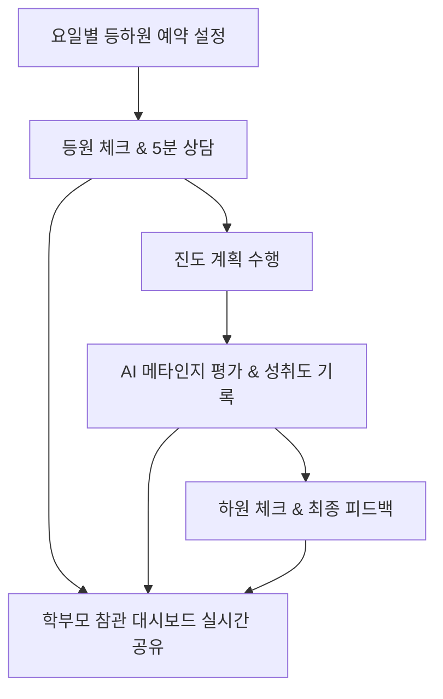

# 🏫 관리형 스터디 카페 운영 툴 활용 가이드
> **MQstudy 자기주도학습 플랫폼 RAG 시스템 기반 운영 매뉴얼**

본 문서는 MQstudy 플랫폼을 실제 **관리형 스터디 카페(Managed Study Cafe)** 비즈니스 모델에 접목하여 원장(점주), 총무(관리자), 수험생(자율형/관리형), 학부모가 유기적으로 소통하고 통제할 수 있도록 설계된 현실적인 운영 가이드라인입니다.

---

## 📌 1. 관리형 스터디 카페 운영 모델 개요

관리형 스터디 카페는 단순히 공부할 공간만을 제공하는 기존 독서실과 달리, **[시간 통제 + 진도 관리 + 메타인지 상담]**을 결합하여 학생의 순공 시간(실제 공부 시간)을 극대화합니다.



### 👥 대상자별 세부 운영 프로세스
*   **자율형 수험생**: 본인이 직접 학습 시간표와 진도 계획을 설정하여 스스로 등하원을 체크하며 주도적으로 학습합니다.
*   **관리형 수험생**: 센터장(점주/관리자)과 1:1 상담을 통해 요일별 약속된 등하원 시간과 진도 비율(가중치)을 설정하며, 매일 등하원 시 **대면 진도 평가(5분 상담)**를 통과해야만 출석 인정을 받습니다.

---

## 🔑 2. 계정 권한 및 역할 정의

### 1) 점주(원장) 및 관리자 (Admin)
*   **권한**: 전 학생의 학습 목표, 진도 가중치 수정, 요일별 등하원 예약 시간 설정, 출결/상담 일지 작성 권한.
*   **주요 임무**:
    *   학생 등록 시 `관리형` 또는 `자율형` 분류 및 참관 코드 발급.
    *   학생별 요일별 입/퇴실 예약 시간(예: 월요일 09:00 ~ 22:00) 설정 및 통제.
    *   등원 시 학생의 어제 학습량/진도를 5분 대면 상담으로 확인 후 등원 완료 및 상담 체크박스 활성화.
    *   특이사항 및 격려 피드백 입력.

### 2) 수험생 (Student)
*   **자율형**: 본인이 대시보드에서 등하원 체크를 직접 수행하고 학습.
*   **관리형**: 지정석 입실 시 관리자 데스크에서 상담을 거쳐 등원 처리를 받아야 학습 시작 가능. 학습 완료 후 대시보드에서 AI와 학습 내용에 대한 `🎙️ 평가받기` 대화를 수행한 뒤 하원 상담을 받음.

### 3) 학부모 (Parent)
*   **권한**: 자녀가 공유해준 6자리 참관 코드를 이용하여 모바일/웹 대시보드에서 실시간 모니터링 (Read-Only).
*   **조회 항목**: 실시간 진도율(프로그래스 바), 날짜별 입퇴실 시간, 관리자의 5분 메타인지 상담 완료 여부 및 피드백 일지.

---

## 🛠️ 3. 핵심 기능별 현장 적용 매뉴얼

### 🗓️ 기능 1. 요일별 등하원 예약 관리 (통제형)
*   **목적**: 학생이 미리 약속한 시간에 스터디 카페에 출석하는지 강제 통제하기 위함.
*   **적용**: 
    *   온보딩 단계에서 입력한 **`일일학습시간`** 및 **`공부가능요일`** 데이터가 등하원 예약 시간표의 기본 뼈대가 됩니다.
    *   관리자는 예약 표에 지정된 시간에 맞춰 지각 여부를 1차 필터링합니다.

> [!IMPORTANT]
> **지각생 관리 가이드**:
> 예약된 등원 시간(예: 09:00)보다 10분 이상 지각 시 시스템에서 적색 경고등이 표시되며, 즉시 학부모에게 예약 시간 미준수 알림을 보낼 수 있는 근거 자료가 됩니다.

---

### 👩‍🏫 기능 2. 5분 메타인지 상담 & 출결 체크
*   **등원 프로세스**: 
    1.  학생이 카페 데스크에 도착하면 관리자(점주)가 `관리 대시보드`를 엽니다.
    2.  학생의 어제 학습량/진도를 3~5분간 가볍게 질문(상담)합니다.
    3.  `등원 시간` 입력 버튼을 누르고 **`5분 메타인지 상담 완료`** 체크박스를 체크한 뒤 상담 피드백을 기록합니다.
*   **하원 프로세스**:
    1.  학생이 당일 배정된 과목별 단원 공부를 마칩니다.
    2.  대시보드에서 `🎙️ 평가받기` 버튼을 눌러 AI 튜터와 음성/텍스트로 메타인지 구술 평가를 완료합니다. (성취율 자동 계산)
    3.  퇴실 시 관리자에게 당일 성취율을 확인받고, 관리자가 최종 `하원 시간`을 체크하여 하루 일과를 종료합니다.

---

### 📊 기능 3. 학부모 실시간 알림 대시보드
*   학부모는 직장이나 가정에서 언제든지 스마트폰으로 자녀의 참관 코드를 입력하여 상태를 조회합니다.

```
[학부모 화면 예시]
──────────────────────────────────────────────────────────
👥 자녀 등하원 및 관리 현황 [관리형]
----------------------------------------------------------
오늘의 등원 정보: 08:58 (정상 입실) | 오늘의 하원 정보: 22:05 (정상 퇴실)
✅ 관리자 5분 메타인지 상담 완료
[오늘의 메타인지 상담 피드백]: 
"수학 3단원 미적분 기초 개념을 완벽하게 구술 설명하였습니다. 
다만 영어 단어 암기 상태가 다소 불안정하여 하원 전 30분 추가 자습 후 퇴실 조치했습니다."
──────────────────────────────────────────────────────────
```

---

## 📈 4. 독학형 vs 관리형 운영 시나리오 비교

| 구분 | 🎒 자율형 (독학형) 수험생 | 🏫 관리형 수험생 |
| :--- | :--- | :--- |
| **계획 수립** | 학생이 대시보드 폼을 통해 스스로 설정 | 관리자와 대면 상담을 거쳐 가중치 및 일정 확정 |
| **출결 통제** | 본인이 직접 대시보드에서 등하원 버튼 터치 | 관리자가 데스크에서 얼굴 대조 및 지각 여부 강제 등록 |
| **진도 점검** | AI 챗봇과의 자율적인 구술 평가 진행 | AI 챗봇 평가 + 관리자와의 5분 메타인지 대면 피드백 |
| **학부모 연계** | 출결 및 진도 자동 업데이트 모니터링 | 관리자의 상세 멘토링 피드백 일지 포함 실시간 공유 |

---

## 🚀 5. 점주/원장을 위한 현장 운영 꿀팁 (Tips)

> [!TIP]
> **등퇴실 및 메타인지 상담 시 핵심 질문 리스트**:
> *   **등원 시**: "어제 계획한 행정법 단원을 다시 남에게 설명한다면 핵심 키워드는 무엇인가요?"
> *   **하원 시**: "오늘 공부한 내용 중 AI가 낸 퀴즈에서 가장 막혔던 부분이 어디였나요?"

> [!WARNING]
> **데이터 신뢰성 유지**:
> 관리형 스터디 카페의 브랜딩 가치는 **엄격하고 투명한 출결 기록**에서 나옵니다. 학생이 임의로 등하원 시간을 조작하지 못하도록, `관리형`으로 등록된 계정은 반드시 **점주/관리자의 `admin` 계정으로만 수정할 수 있도록** 통제 설정을 철저히 유지하십시오.
