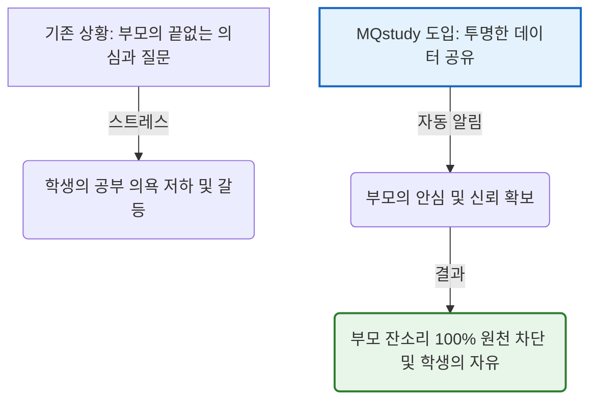

# 📢 MQstudy 관리형 서비스 마케팅 및 포지셔닝 전략 가이드
> **학부모의 '통제 욕구'와 학생의 '불편함/구속감' 사이의 마찰을 해소하는 셀링 포인트(Selling Point) 정의**

독학 관리형 스터디 카페의 가장 큰 마케팅 장애물은 **"학부모는 결제하고 싶어 하지만, 학생은 구속감을 느껴 등원을 거부한다"**는 점입니다. 이 간극을 극복하고 학생 스스로 발을 들여놓게 만드는 스마트한 포지셔닝과 마케팅 홍보 전략을 제안합니다.

---

## ⚖️ 1. 핵심 포지셔닝: "통제"가 아니라 "잔소리로부터의 해방"

학생들이 느끼는 가장 큰 스트레스는 부모님의 **"공부했니?", "오늘 뭐 배웠니?", "시험 범위는 다 봤니?"** 같은 주관적이고 반복적인 잔소리입니다. MQstudy의 자동화 시스템을 통해 이 프레임을 완전히 전환합니다.

* **학생 설득 프레이밍**: 
  > *"여기서 스마트하게 하루 공부 딱 끝내고 투명하게 데이터로 보여주면, 부모님은 네 공부에 대해 단 한 마디도 잔소리할 수 없게 된다. 당당하게 공부하고 집에서는 스마트폰을 보든 게임을 하든 완벽한 자유를 누려라."*
* **셀링 포인트**: 시스템 통제를 **"부모의 간섭과 의심을 원천 차단하는 방패"**로 포지셔닝합니다.

---

## 🎯 2. 타깃별 이원화 홍보 카피라이팅 및 메시지

학부모와 학생이 매력을 느끼는 지점은 완전히 다릅니다. 블로그, 인스타그램, 현수막, 리플릿 제작 시 홍보 메시지를 이원화하여 노출해야 합니다.

### 👩‍👦 학부모 타깃 메시지: "안심과 과학적 검증"
* **핵심 키워드**: `#밀착통제`, `#메타인지검증`, `#스마트출결`, `#학습공백제로`
* **홍보 카피 예시**:
  1. *"매일 10분 지각 감지부터 AI 구술 평가까지, 자녀의 학습 공백을 눈으로 실시간 확인하세요."*
  2. *"아이가 스터디 카페에서 무엇을 공부했는지 물어보며 싸우지 마세요. MQstudy가 스마트폰으로 성취도를 매일 브리핑해 드립니다."*
  3. *"학원 수업만 듣고 오면 아는 것 같나요? AI가 말로 설명하게 시켜 개념 구멍을 완벽히 찾아냅니다."*

### 🎒 학생(이용자) 타깃 메시지: "당당한 자유와 효율성"
* **핵심 키워드**: `#잔소리해방`, `#순공시간효율`, `#감정소모제로`, `#AI과외쌤`
* **홍보 카피 예시**:
  1. *"하루 3번 카드만 찍어라. 집에선 부모님 잔소리 없이 당당하게 게임하고 쉴 수 있게 해줄게."*
  2. *"문제집 기계적으로 풀며 시간 때우지 마. 핵심 목표만 공부하고 AI한테 통과받으면 오늘 자습은 쿨하게 종료!"*
  3. *"무서운 선생님의 감정 섞인 지적은 이제 그만. 편안한 AI와 채팅하면서 내 메타인지 실력만 빠르게 점검하자."*

---

## 💡 3. 학생의 불편함을 낮추는 장치 및 홍보 요소

학생들이 입소문을 내고 스터디 카페를 선호하게 만드는 시스템적 유인 요소들을 강조하여 홍보합니다.

1. **"문제집 몇 페이지 풀기" 억지 진도 배제**:
   * 학생들에게 **"우리 카페는 억지로 100페이지 풀어오라고 독촉하지 않는다"**는 점을 홍보합니다. 
   * 단원 목표를 달성하는 방법은 동영상 강의를 듣든 개념서를 읽든 본인의 학습 스타일에 100% 맞춤 제공되므로 학습 피로도가 매우 낮음을 강조합니다.
2. **감정 소모 없는 쿨한 AI 튜터**:
   * 사람이 꼬치꼬치 캐묻거나 비교하며 평가하는 것이 아니라, 친근한 대화형 AI가 객관적으로 구술 평가를 도와줍니다. 
   * 틀려도 부끄럽지 않고 게임 퀘스트를 깨듯 성취감을 느낄 수 있는 **"게이미피케이션(Gamification)" 요소**로 홍보합니다.
3. **순수 스터디 카페 자습 시간만 계산**:
   * 불필요하게 낭비되는 시간(이동 시간, 학원 시간 등)을 빼고 오롯이 스터디 카페에 앉아있는 효율적인 시간만을 타깃으로 타이트한 최적화 진도를 보장합니다. **"시간 대비 가장 빠르게 퇴근할 수 있는 공부 명당"**임을 알립니다.

---

## 📈 4. 온보딩 시 오리엔테이션 전략

신규 계약 시 관리자가 부모님과 학생이 함께 있는 자리에서 다음과 같이 약속을 선언합니다.

> *"어머님, 아버님. 이제부터 학생의 공부 현황과 입퇴실 시간은 저희 시스템이 실시간으로 투명하게 보고드릴 것입니다. 따라서 집에서는 학생이 공부를 하든 쉬든 절대로 공부 얘기로 잔소리하지 않겠다고 약속해 주십시오. 그리고 학생분도 이 약속을 위해 독서실 안에서만큼은 3번 카드 태깅과 하루 목표 달성을 완수해 주는 멋진 파트너십을 보여줍시다."*

이 3자 파트너십 선언을 통해 학생은 **"나를 옥죄기 위한 시스템이 아니라, 내 사생활과 휴식을 보장받기 위한 계약서구나"**라고 느끼며 관리형 서비스에 훨씬 자발적으로 순응하게 됩니다.
